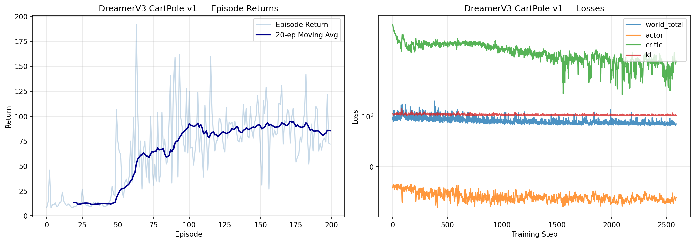
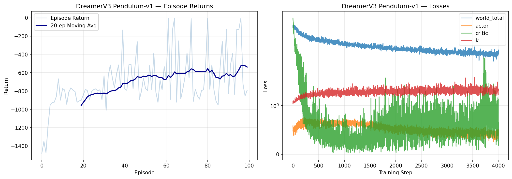

# DreamerV3 from Scratch

A clean, educational implementation of **DreamerV3** (Hafner et al., Nature 2025) — the state-of-the-art model-based reinforcement learning algorithm that learns a world model and trains agents entirely "in imagination."

<p align="center">
  
  
</p>

## What is DreamerV3?

Traditional RL algorithms (DQN, PPO) learn by trial and error in the real environment. **DreamerV3** takes a fundamentally different approach:

1. **Learn a World Model** — An RSSM (Recurrent State-Space Model) that predicts how the environment works
2. **Dream** — Generate imagined trajectories using the learned model
3. **Learn in Imagination** — Train the actor-critic on dreamed experience, not real interaction

This is dramatically more sample-efficient: instead of needing millions of real environment steps, the agent can generate unlimited imagined experience from a compact world model.

## Key Innovations Implemented

| Innovation | What it does | Why it matters |
|---|---|---|
| **RSSM** | GRU (deterministic) + Categorical latent (stochastic) | Captures both temporal dependencies and uncertainty |
| **Symlog Transform** | `sign(x) * ln(\|x\|+1)` | Handles reward scales from -100 to +100k |
| **Twohot Encoding** | Soft distribution over 255 bins | Richer gradient signal than scalar regression |
| **Free Bits** | `max(1, KL)` per variable | Prevents KL collapse (prior becoming useless) |
| **Percentile Normalization** | `scale = max(1, P95-P5)` | Stable returns regardless of reward magnitude |
| **Unimix** | `0.99*softmax + 0.01*uniform` | Prevents categorical probability collapse |
| **Straight-Through** | `one_hot + probs - sg(probs)` | Gradients through discrete sampling |

## Project Structure

```
dreamer-from-scratch/
├── dreamer/
│   ├── utils.py              # symlog, twohot, percentile normalization
│   ├── networks.py           # Encoder, Decoder, RewardHead, ContinueHead, Actor, Critic
│   ├── rssm.py               # RSSM world model (GRU + categorical latent)
│   ├── replay_buffer.py      # Sequence replay buffer
│   └── agent.py              # DreamerAgent (world model + actor-critic)
├── 01_world_model_demo.py    # Train world model only, visualize predictions
├── 02_dreamer_cartpole.py    # Full DreamerV3 on CartPole-v1 (discrete)
├── 03_dreamer_pendulum.py    # Full DreamerV3 on Pendulum-v1 (continuous)
├── 04_visualize.py           # Latent t-SNE, imagined vs real trajectories
├── 05_dreamer_acrobot.py     # DreamerV3 on Acrobot-v1 (sparse reward)
├── 06_dreamer_lunar_lander.py # DreamerV3 on LunarLander-v3 (complex dynamics)
└── train_all.py              # Run all experiments
```

## Quick Start

```bash
# Install dependencies
pip install torch gymnasium matplotlib numpy scikit-learn

# For LunarLander (optional)
pip install gymnasium[box2d]  # may need: brew install swig

# Run world model demo
python 01_world_model_demo.py

# Train on CartPole (discrete actions)
python 02_dreamer_cartpole.py

# Train on Pendulum (continuous actions)
python 03_dreamer_pendulum.py

# Train on harder environments
python 05_dreamer_acrobot.py
python 06_dreamer_lunar_lander.py

# Generate visualizations
python 04_visualize.py
```

## How It Works

### 1. World Model (RSSM)

The RSSM maintains two types of state:

```
Deterministic:  h_t = GRU(h_{t-1}, [z_{t-1}, a_{t-1}])     # Memory
Stochastic:     z_t ~ Categorical(16 vars × 16 classes)      # Uncertainty

Posterior:      q(z_t | h_t, encoder(obs_t))    # Uses real observation
Prior:          p(z_t | h_t)                      # Prediction only (for dreaming!)
```

### 2. World Model Training

```
Loss = Decoder(symlog MSE) + Reward(twohot CE) + Continue(BCE) + 0.5 * max(1, KL)
```

### 3. Actor-Critic in Imagination

```python
# Start from real states (posterior)
for t in range(horizon):
    action = actor(latent)              # Policy chooses action
    latent = world_model.imagine(action)  # Dream next state (no real env!)
    rewards.append(reward_head(latent))

# Compute lambda-returns and update actor to maximize returns
# Gradient flows: actor → action → world_model → reward → returns
```

## Environments

| Environment | Type | Difficulty | Key Challenge |
|---|---|---|---|
| CartPole-v1 | Discrete | Easy | Balance a pole (constant +1 reward) |
| Pendulum-v1 | Continuous | Medium | Swing up + balance (dense negative reward) |
| Acrobot-v1 | Discrete | Hard | Swing up double pendulum (sparse -1 reward) |
| LunarLander-v3 | Discrete | Hard | Land spacecraft (complex multi-phase reward) |

## Blog Post

For a detailed walkthrough of this implementation, check out:
[DreamerV3 World Model RL: PyTorch Implementation](https://tildalice.io/dreamerv3-world-model-rl-pytorch-implementation/)

## Related Projects

- [simpleRL-reason](https://github.com/DrunkJin/simpleRL-reason) — DQN to PPO from scratch
- [diffusion-from-scratch](https://github.com/DrunkJin/diffusion-from-scratch) — Diffusion models from scratch
- [mcp-python-tutorial](https://github.com/DrunkJin/mcp-python-tutorial) — MCP Protocol tutorial

## References

- [Mastering Diverse Domains through World Models](https://arxiv.org/abs/2301.04104) — Hafner et al., Nature 2025
- [Dream to Control](https://arxiv.org/abs/1912.01603) — DreamerV1
- [Mastering Atari with Discrete World Models](https://arxiv.org/abs/2010.02193) — DreamerV2

## License

MIT
